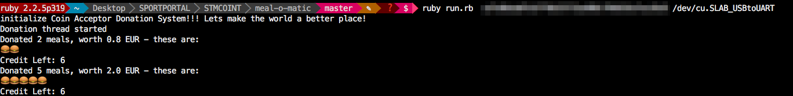
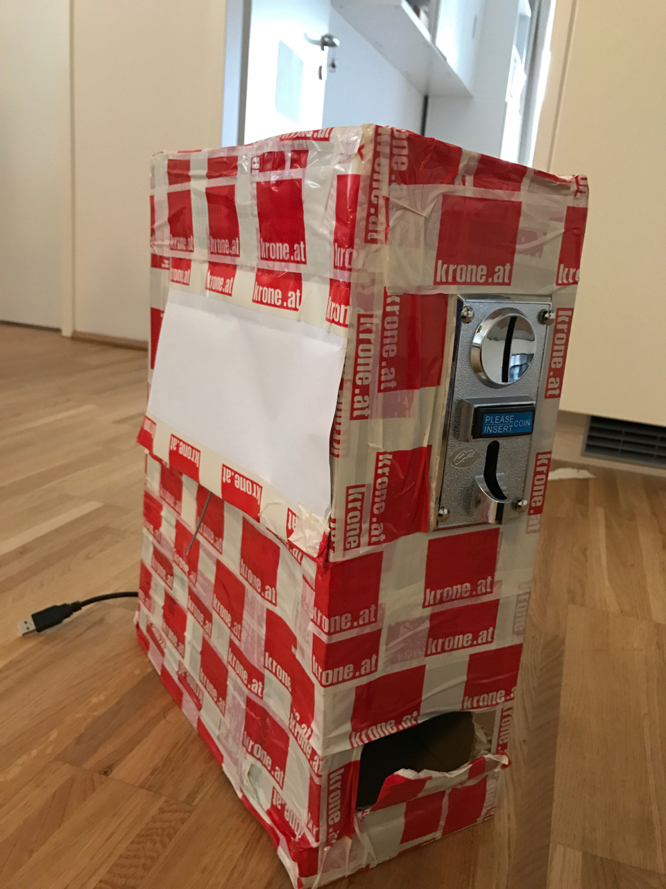

# Requirements
  * CH-926 Coin Acceptor
  * 12V Wall Adapter + pin out
  * usb ftdi breakit.
  * ShareTheMeal userhash
  

# Run
```
bundle install
bundle exec ruby run.rb USERHASH /dev/usb_device
```




# Hardware



  * Programm the CH-926 that it fits your needs.
  * I Did the following
  
  | Coin Index    | Pulses        |  EUR coin |
  | ------------- |:-------------:|:---------:|
  | 1             | 1             |  0.10     |
  | 2             | 2             |  0.20     |
  | 3             | 5             |  0.50     |
  | 4             | 10            |  1.00     |
  | 5             | 20            |  2.00     |
  
  
  * If you change the Pules amount or value adjust the `@cents_per_signal` in `run.rb`

  